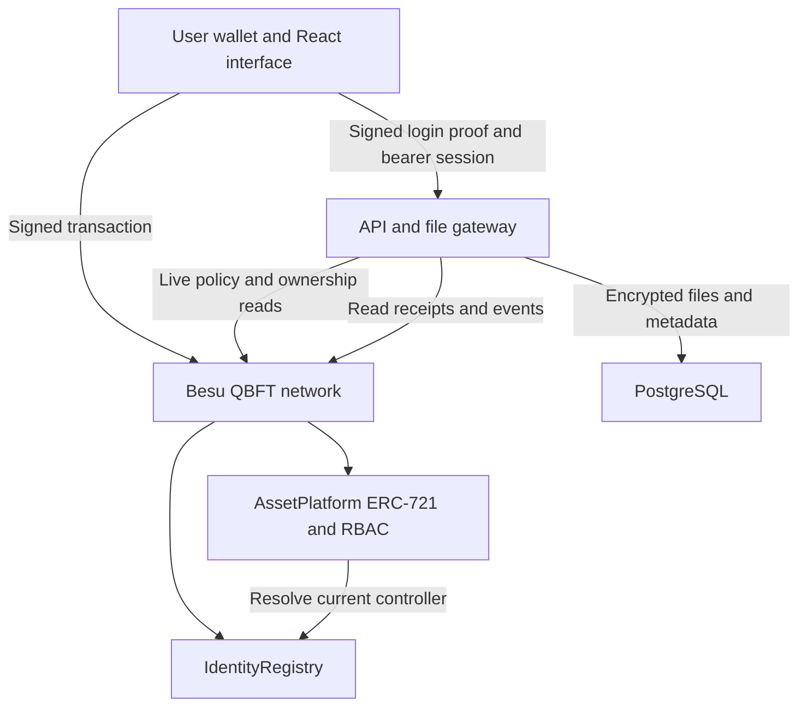
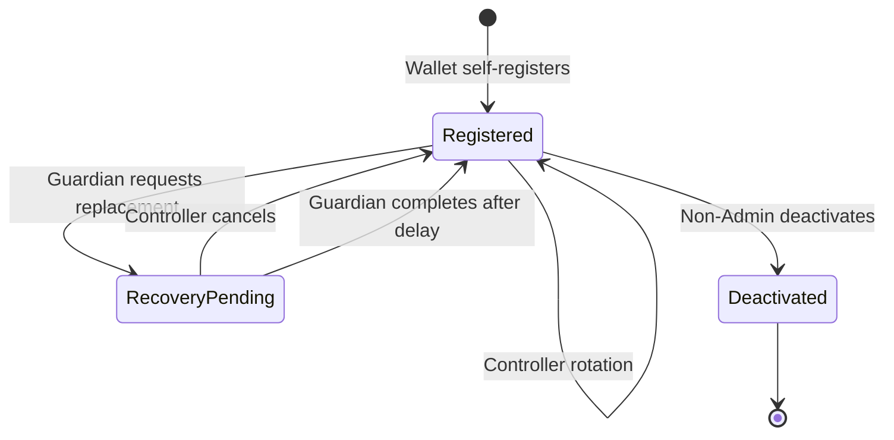
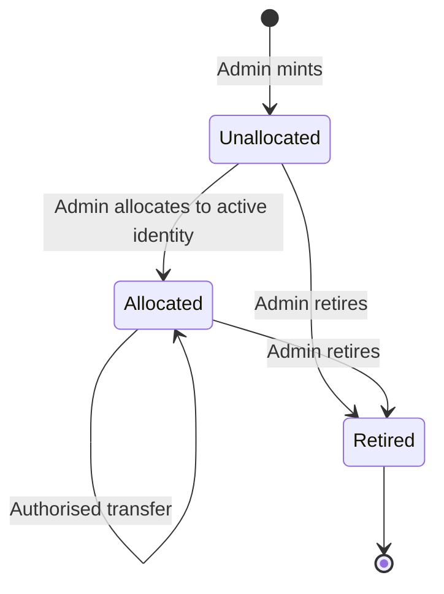

# Architecture and trust boundaries

The blockchain is authoritative for identity controllers, organisation roles, token ownership, permissions and lifecycle changes. PostgreSQL stores encrypted content, private metadata, sessions and derived operational data. The API never signs a user transaction with an administrator key.

## Identity and sessions

1. A wallet signs a single-use challenge containing origin, chain ID, registry, controller, random nonce, expiration and challenge ID.
2. PostgreSQL atomically consumes the challenge before creating a session. Reusing it cannot produce another session.
3. The API resolves the signer to an active identity through IdentityRegistry. It stores only a hash of the random bearer token.
4. Every authenticated API request checks current controller, identity version, activity and suspension. Sensitive routes additionally check current contract permissions.
5. User transactions are signed locally. AssetPlatform resolves `msg.sender` through the registry and evaluates current policy again during execution.

Session tokens and decrypted wallets remain in browser memory. The server never receives the encrypted-wallet password or private key. A compromised browser can still steal keys or sign malicious requests; this prototype does not provide hardware isolation.

## Identity lifecycle

An organisation can suspend access without destroying the underlying identity. Token owners are stable identity addresses, not replaceable controller addresses. Administrators must be demoted before deactivation, and the last Admin cannot be demoted by the platform.

## Asset lifecycle

Unallocated tokens are held in contract escrow. Only initial allocation can release escrow. All standard transfer entry points ultimately execute the policy-enforcing override. ERC-721 operator approvals are disabled to remove an alternate transfer-authority path.

On transfer, a per-asset grant version increments. Existing non-owner document grants no longer match that version and cannot survive the ownership change. This avoids iterating an unbounded list of grantees.

## Documents and metadata

The Admin stages a file up to 2 MiB. The API encrypts it with AES-256-GCM and a fresh random nonce, stores ciphertext in PostgreSQL and returns a random URI plus content/code hashes. The wallet then signs the mint transaction. Failed/cancelled mints can leave staged files; these are inaccessible without a valid token reference and policy. Automatic orphan cleanup is not implemented.

Downloads check `canRead`, authenticate/decrypt the ciphertext, compare its SHA-256 hash to the on-chain commitment, and check current access once more before serving bytes as an attachment. This reduces stale-policy windows but cannot create an atomic transaction across an HTTP download and blockchain finality. A permission change concurrent with a completed download cannot revoke bytes already released.

## Evidence

- State-changing identity, governance and asset operations emit on-chain events.
- The audit explorer retrieves events directly from nodes. It does not trust database ownership rows.
- Reverted transactions keep failed receipts but no emitted logs; preflight failures may have no mined receipt.
- Authentication and download decisions are off-chain, hash-linked in PostgreSQL. An Auditor/Admin can anchor the current head digest on-chain.
- Anchoring detects rewriting/removing history that was committed. It cannot prove the completeness of unanchored events or prevent a compromised gateway from omitting an event before logging it.
- Experiment reports have canonical JSON digests and optional on-chain anchors. They are operator-generated evidence, not third-party certification.

## Network

Four fixed validator identities form the local QBFT network. Peers are explicitly allowlisted. Node RPC and application ports are bound to the host loopback interface; PostgreSQL and other validator RPC ports are not published. Only ETH, NET and WEB3 RPC namespaces are enabled. Administrative/debug RPC APIs are not exposed.

Blockchain metadata is visible to actors who can access the local RPC/node. API roles restrict application views and document access, not cryptographic secrecy of all ledger data. Production organisation separation needs independent hosts, authenticated network ingress and a reviewed governance model.

The browser and API currently depend on Validator 1 for RPC. Other validators can maintain consensus if Validator 1 stops, but application access would require changing/failing over RPC. The scripted resilience experiment stops Validator 4 so it measures consensus continuity without also removing the application's configured RPC endpoint.
